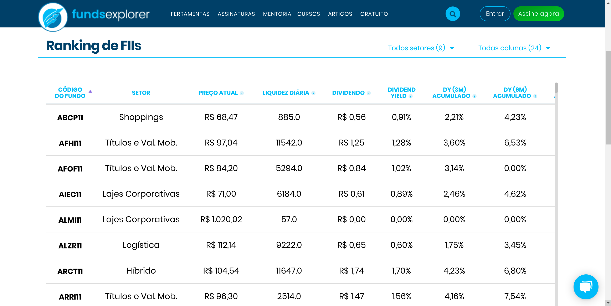
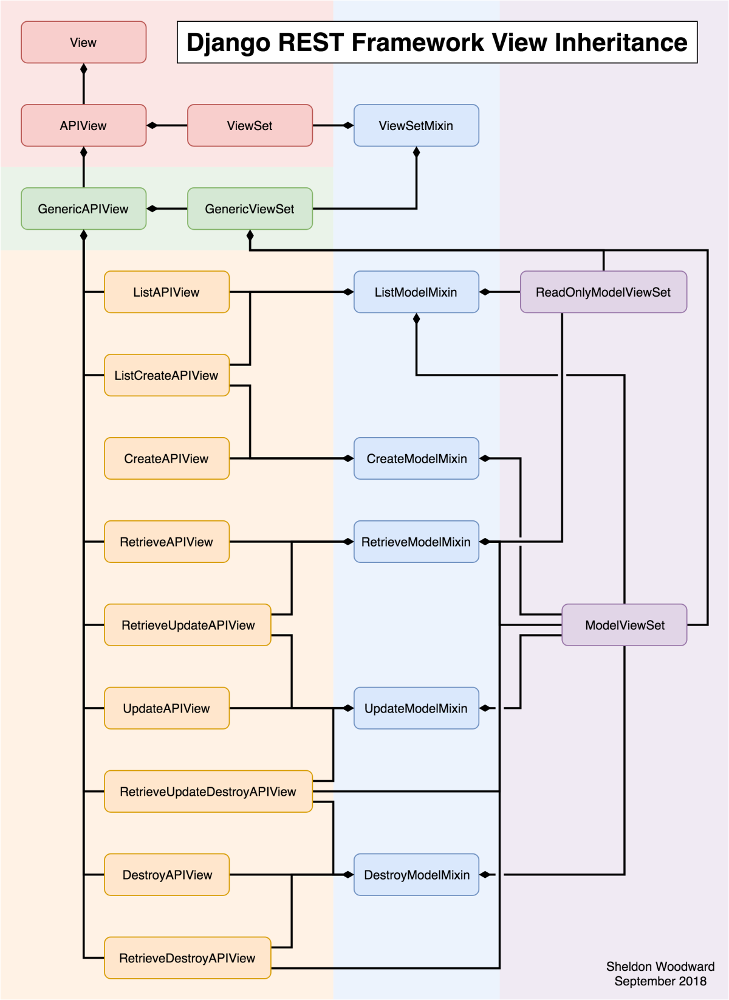

# FUNDSFINDER

API desenvolvida com [Django](https://www.djangoproject.com/), [Django REST Framework](https://www.django-rest-framework.org/) para consulta de um tipo de investimento: Fundos Imobiliários (ou FIIs).

## Modelagem

O processo de desenvolvimento de aplicações que utilizam o Django Rest Framework geralmente seguem a seguinte linha de implementação:

1. Modelagem;
2. Serializers;
3. ViewSets;
4. Routers

Vamos começar com a Modelagem!

Para auxiliar nessa tarefa, escolhi alguns parâmetros de uma tabela muito interessante do site [FundsExplorer](https://www.fundsexplorer.com.br/ranking):



Vamos usar os seguintes atributos:

- **Código do Fundo**: Código identificador do Fundo.
- **Setor**: Setor do Fundo Imobiliário.
- **Dividend Yield médio (12 meses)**: Dividend Yield mostra quanto um fundo paga de Dividendos (divisão de lucros) sobre o valor atual da cota.
- **Vacância Financeira**: Importante métrica que mostra ao investidor quantos ativos do Fundo Imobiliários estão inadimplentes.
- **Vacância Física**: Outra importante métrica que mostra ao investidor quantos ativos estão desocupados.
- **Quantidade de Ativos**: Quantos ativos são administrados pelo Fundo.

Com isso em mãos, podemos criar a modelagem da entidade **FundoImobiliario**.

## Serializer

Eles servem para traduzir entidades complexas, como querysets e instâncias de classes em representações simples que podem ser usadas no tráfego da web, como JSON e XML.

Esse processo é chamado de Serialização.

Serializers também servem para fazer o caminho contrário: a Desserialização.

Isto é, transformar representações simples (como JSON e XML) em representações complexas, instanciando objetos, por exemplo.

O DRF disponibiliza diversos tipos de serializers que podemos utilizar, como:

BaseSerializer: Classe base para construção de Serializers mais genéricos.
ModelSerializer: Auxilia a criação de serializadores baseados em modelos.
HyperlinkedModelSerializer: Similar ao ModelSerializer, contudo retorna um link para representar o relacionamento entre entidades (ModelSerializer retorna, por padrão, o id da entidade relacionada).
Vamos utilizar o ModelSerializer para construir o serializador da entidade FundoImobiliario.

Para isso, precisamos declarar sobre qual modelo aquele serializador irá operar e quais os campos que ele deve se preocupar.

## ViewSets

As ViewSets definem quais operações REST estarão disponíveis e como seu sistema vai responder às chamadas à sua API.

Em outros frameworks, são chamados de Resources ou Controllers.

ViewSets herdam e adicionam lógica às Views padrão do Django.

Suas responsabilidades são:

Receber os dados da Requisição (formato JSON ou XML)
Validar os dados de acordo com as regras definidas na modelagem e no Serializer
Desserializar a Requisição e instanciar objetos
Processar regras de negócio (aqui é onde implementamos a lógica dos nossos sistemas)
Formular uma resposta e responder a quem chamou sua API

Encontrei uma imagem muito interessante no [Reddit](https://www.reddit.com/r/django/comments/9grsum/a_django_rest_framework_view_inheritance_diagram/) que mostra o diagrama de herança das classes do DRF, que nos ajuda a entender melhor a estrutura interna do framework:



Na imagem:

- Lá em cima, temos a classe View padrão do Django.
- APIView e ViewSet são classes do DRF que herdam de View e que trazem algumas configurações específicas para transformá-las em APIs, como métodos get() para tratar requisições HTTP GET e post() para tratar requisições HTTP POST.
- Logo abaixo, temos a GenericAPIView - que é a classe base para views genéricas - e a GenericViewSet - que é a base para as ViewSets (a parte da direita em roxo na imagem).
- No meio, em azul, temos os Mixins. Eles são os blocos de código responsáveis por realmente implementar as ações desejadas.
- Em seguida temos as Views que disponibilizam as funcionalidades da nossa API, como se fossem blocos de Lego. Elas estendem dos Mixins para construir a funcionalidade desejada (seja listagem, seja deleção e etc)

Por exemplo: se você quiser criar uma API que disponibilize apenas listagem de uma determinada Entidade você poderia escolher a ListAPIView.

Agora se você precisar construir uma API que disponibilize apenas as operações de criação e listagem, você poderia utilizar a ListCreateAPIView.

Agora se você precisar construir uma API “com tudo dentro” (isto é: criação, deleção, atualização e listagem), escolha a ModelViewSet: perceba que ela estende todos os Mixins disponíveis.

Para entender de vez:

- Os Mixins são como os componentes dos sanduíches do Subway :tomato: :bread: :poultry_leg: :meat_on_bone:
- As Views são como o Subway: você monta o seu, componente à componente :bread:
- As ViewSets são como o McDonalds: seu sanduíche já vem montado :hamburger:

## Routers

Os Routers nos auxiliam na geração das URLs da nossa aplicação.

Como o REST possui padrões bem definidos de estrutura de URLs, o DRF as gera automaticamente para nós, já no padrão correto.

Basta utilizarmos seus Routers!

Exemplo:

```bash
from rest_framework.routers import DefaultRouter
from api.views import FundoImobiliarioViewSet


app_name = 'api'

router = DefaultRouter(trailing_slash=False)
router.register(r'fundos', FundoImobiliarioViewSet)

urlpatterns = router.urls
```

Vamos entender:

- app_name é necessário para dar contexto às URLs geradas. Esse parâmetro especifica o namespace das URLConfs adicionadas.
- DefaultRouter é o Router que escolhemos para geração automática das URLs. O parâmetro trailing_slash especifica que não é necessário o uso de barras / no final da URL.
- O método register recebe dois parâmetros: o primeiro é o prefixo que será usado na URL (no nosso caso: http://localhost:8000/fundos) e o segundo é a View que ira responder as URLs com esse prefixo.
- Por último, temos o velho urlpatterns do Django, que utilizamos para expor as URLs desse app.

## Instalação

Primeiro, recomenda-se a criação de um ambiente virtual.

```bash
python3 -m venv .venv
```

Com seu ambiente virtual configurado, instale as dependências do projeto com:

```bash
pip install -r requirements-dev.txt
```

Para criar as _Migrations_:

```bash
python manage.py makemigrations
```

Para efetivar as _Migrations_ no banco de dados:

```bash
python manage.py migrate
```

## Execução

Para executar o servidor de testes do Django, execute:

```bash
python manage.py runserver
```

Conteúdo retirado da [Python Academy](https://pythonacademy.com.br/blog/construcao-de-apis-com-django-rest-framework)
