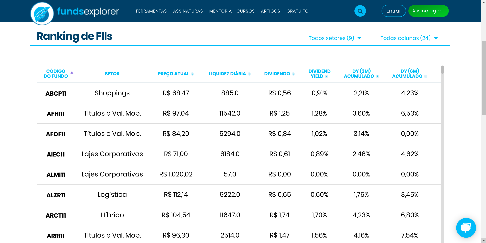

# FUNDSFINDER

API desenvolvida com [Django](https://www.djangoproject.com/), [Django REST Framework](https://www.django-rest-framework.org/) para consulta de um tipo de investimento: Fundos Imobiliários (ou FIIs).

## Modelagem

O processo de desenvolvimento de aplicações que utilizam o Django Rest Framework geralmente seguem a seguinte linha de implementação:

1. Modelagem;
2. Serializers;
3. ViewSets;
4. Routers

Vamos começar com a Modelagem!

Para auxiliar nessa tarefa, escolhi alguns parâmetros de uma tabela muito interessante do site [FundsExplorer](https://www.fundsexplorer.com.br/ranking):

Vamos usar os seguintes atributos:

- **Código do Fundo**: Código identificador do Fundo.
- **Setor**: Setor do Fundo Imobiliário.
- **Dividend Yield médio (12 meses)**: Dividend Yield mostra quanto um fundo paga de Dividendos (divisão de lucros) sobre o valor atual da cota.
- **Vacância Financeira**: Importante métrica que mostra ao investidor quantos ativos do Fundo Imobiliários estão inadimplentes.
- **Vacância Física**: Outra importante métrica que mostra ao investidor quantos ativos estão desocupados.
- **Quantidade de Ativos**: Quantos ativos são administrados pelo Fundo.

Com isso em mãos, podemos criar a modelagem da entidade **FundoImobiliario**.

## Serializer

Eles servem para traduzir entidades complexas, como querysets e instâncias de classes em representações simples que podem ser usadas no tráfego da web, como JSON e XML.

Esse processo é chamado de Serialização.

Serializers também servem para fazer o caminho contrário: a Desserialização.

Isto é, transformar representações simples (como JSON e XML) em representações complexas, instanciando objetos, por exemplo.

O DRF disponibiliza diversos tipos de serializers que podemos utilizar, como:

BaseSerializer: Classe base para construção de Serializers mais genéricos.
ModelSerializer: Auxilia a criação de serializadores baseados em modelos.
HyperlinkedModelSerializer: Similar ao ModelSerializer, contudo retorna um link para representar o relacionamento entre entidades (ModelSerializer retorna, por padrão, o id da entidade relacionada).
Vamos utilizar o ModelSerializer para construir o serializador da entidade FundoImobiliario.

Para isso, precisamos declarar sobre qual modelo aquele serializador irá operar e quais os campos que ele deve se preocupar.
